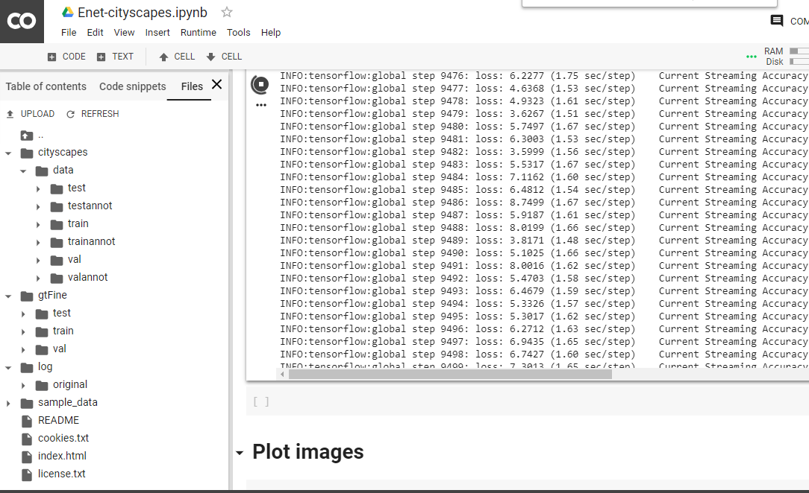

# Enet-cityscapes
Enet network on cityscapes dataset

- Run [```Enet_cityscapes.ipynb```](Enet_cityscapes.ipynb) in google colab.
- Your folder will look like this

- Read [here](understanding_cityscapes_dataset.md) if you want to know more about datasets in cityscapes.
      
